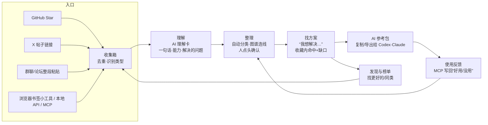
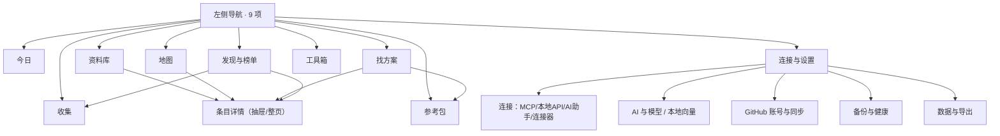
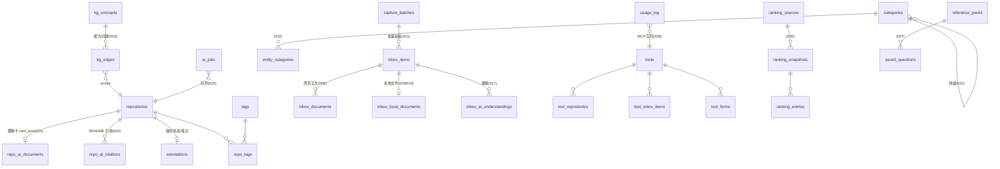
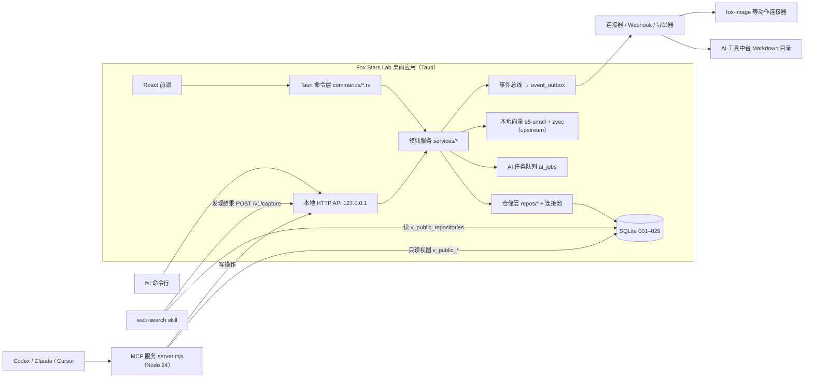
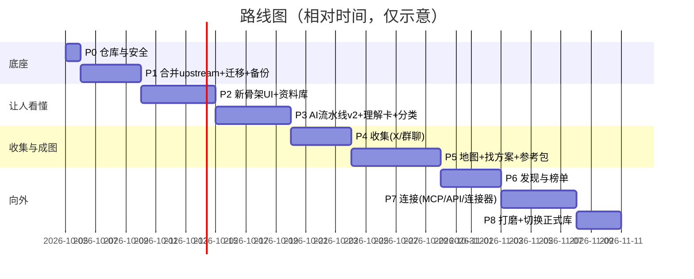

# Fox Stars Lab 2.0 产品重设计与开发说明书

> 版本 v1.0｜2026-10-01（北京时间）｜面向：Fox（产品决策者，非专业开发）＋ Grok Build（在 Fox 的 Mac 上执行全部开发的 AI 编码工具）
> 依据：live 库 `fox-stars-lab.sqlite3`（迁移 001–018，2026-10-01 12:30 最后同步，492 个有效仓库）的真实数据统计；安装版 1.4.0-fox.1 的 104 个命令；upstream v1.5.3 界面与代码；7-12 三角色评审；Fox 本机 web-search / fox-image / AI 工具中台现状；GitHub 榜单类工具的公开 API 调研。
> 配套文件（同目录）：`重建方案.md`（源码丢失后的工程重建方案）、`migrations/`（001–018 原始迁移 + `proposed/019–029` 新迁移草案，已验证可在 018 库上顺序执行）、`commands/`（命令/表矩阵）、`mcp/`（找回的 MCP 源码）、`spec/taxonomy_seed.json`（分类种子）、`spec/ai_card.schema.json`（理解卡结构）。
>
> 阅读建议：Fox 读 §0–§8（白话）；Grok Build 读全文，重点 §9–§14 和附录。

---

## 0. 一页摘要

**一句话定位：把“随手 Star 的一堆仓库和链接”变成“我自己的 AI 工具情报库”——看得懂、分得清、找得到、还能直接打包喂给 Codex / Claude 去干活。**

五个关键决定：

1. **让 AI 替你整理，而不是让你手填。** 真实数据显示：492 个收藏里，自建标签 0 个、笔记 0 条、阅读状态全部是“未读”、投喂 1 条、工具卡 1 张、场景 0 个。1.4.0 的手工整理功能基本没被用上。2.0 默认由 AI 自动生成“理解卡”、自动分类、自动连成图谱；你只做“点头 / 改一下 / 不要”。
2. **以“问题”为中心，而不是以“仓库”为中心。** 新增「找方案」：你写“我想批量给小红书做封面”，它从你的收藏里找出能用的、说明为什么、指出缺口，再去外面找更好的，最后一键生成「AI 参考包」。
3. **收集入口从 GitHub 扩大到 X、群聊、论坛。** 一次粘贴一大段群聊或帖子，自动抽出所有链接和 GitHub 仓库，去重后进收集箱。
4. **新增「榜单」，并且是“按你的口味筛过的榜单”。** 接入 GitHub 搜索榜、OSS Insight、Hacker News 等免费合法来源，标出“跟你收藏的哪类相似”“你已经收藏了”。
5. **做成“底座”，不做孤岛。** 提供双向 MCP、本地 API、命令行和稳定的只读数据视图，让 web-search、本机 Skills、AI 工具中台、Codex/Claude 都能读写它。

同时**砍掉 / 冻结**：场景评估组、8×5 对比矩阵、决策修订链（数据为 0，界面隐藏，表保留不删）；标签网络页、个人画像页、旧仪表盘合并进新页面。

页面从 1.4.0 的十几个入口收敛为 **9 个主页面**：今日、收集、资料库、地图、找方案、参考包、发现与榜单、工具箱、连接与设置。

---

## 1. 需求洞察

### 1.1 Fox 的真实行为（来自 live 数据，2026-10-01）

| 观察 | 数据 | 含义 |
|---|---|---|
| 收藏量增长很快 | 492 个有效仓库；2026-06 起每月 119 / 149 / 117 / 56 个 | 每天都在“先收着再说”，靠人力看不过来 |
| 内容高度集中在 AI Agent 生态 | topic 前列：claude-code 81、codex 73、ai 64、llm 56、ai-agents 53、mcp 36、agent-skills 33、openclaw 23、cursor 22、deepseek 19 | 分类体系要按“AI 工具生态”来切，而不是按编程语言 |
| 编程语言不是有用的维度 | Python 153、TypeScript 129、JavaScript 57、无语言 33 | 语言只做次要筛选 |
| GitHub topic 不可靠 | 308/492（63%）有 topic，其余没有 | 必须靠 AI 读 README 补齐 |
| 手工整理几乎没用 | 标签 0、笔记 0、阅读状态 100% 未读、投喂 1、工具 1、场景 0 | 手填流程不可持续，要改成 AI 先做、人确认 |
| AI 理解覆盖低、失败多 | 只有 92/492 有 AI 文档（其中 76 篇 partial）；150 个失败任务中 139 个是“应用已退出，任务中断” | AI 任务必须能在后台断点续跑，关掉 app 也不丢 |
| 已有 AI 投入 | 92 篇用了约 27 万输入 token、9 万输出 token（LongCat-2.0） | 平均每篇约 3k 入 / 1k 出，全量 500 篇成本可控 |
| 中文场景强 | 小红书、微信、抖音、公众号相关 topic 和 AI 摘要大量出现 | 分类里要有“内容创作与自媒体增长”，界面全部中文 |
| 本机已有一套 AI 工具体系 | `~/.agents/skills/` 下 70+ 个 skill（web-search、fox-image、ai-draw、lark-* 等）；`~/WorkSpace/_infra/AI工具中台` | 新发现的工具要能和“你本机已经有什么”对照 |
| 已有外部依赖 | web-search 的 `stars` 子命令直接读 Fox 库的 `repositories / repo_ai_documents / repo_tags / annotations` | 这些表**不能改名、不能删列**；以后通过稳定视图对接 |

### 1.2 Fox 的需求（转成产品语言）

| # | Fox 原话（概括） | 产品能力 | 成功标准 |
|---|---|---|---|
| N1 | 知道自己收藏了什么 | 每个条目自动生成中文“理解卡”（一句话说明 + 能做什么 + 怎么试） | 打开资料库，95% 的条目有一句话中文说明 |
| N2 | 像知识图谱一样知道有哪些类型、各自解决什么问题 | 两级分类 + 能力 / 问题节点 + 关系图 | 「地图」页能看到 15 个大类的分布，点进去看到“能力→工具”网络 |
| N3 | 根据收藏发现更多、更好的同类 | 「发现」：基于收藏画像和向量相似度推荐，标出替代 / 互补关系 | 每周推荐 ≥10 个未收藏的高相关候选，每个都附推荐理由 |
| N4 | 从中找灵感和方向，交给其他 AI 去做 | 「找方案」+「AI 参考包」导出（Markdown / AGENTS.md / JSON / MCP 资源） | 从提问到拿到可直接粘贴给 Codex 的参考包 ≤ 2 分钟 |
| N5 | 看 GitHub 优质内容榜单 | 「榜单」：多来源合法聚合 + 按你的口味过滤 | 至少 3 个免费来源可用，每条都标“与你收藏的相关度” |
| N6 | 散落的工具连起来，不当孤岛 | 双向 MCP、本地 API、CLI、连接器、事件、稳定视图 | web-search、Codex、Claude 都能查、能写回；本机 Skills 能出现在「工具箱」 |
| N7 | 发现主要在 X、群聊、论坛 | 「收集」：粘贴一大段文本自动抽链接；X 帖子用官方 oEmbed 取正文 | 粘贴一段 30 条消息的群聊，10 秒内抽出全部链接并去重 |
| N8 | 现在很多功能和界面做得不好 | 整体 UI 重做，页面收敛，状态管理重构 | 见 §4 各页验收 |

### 1.3 不做什么（边界）

- 不做多人协作 / 多账号切换。表里有 account_id 就保留，界面按单账号设计（评审：多账号守护属于过度设计）。
- 不做“公司级决策系统”。场景评估矩阵和决策修订链冻结。
- 不自动安装任何发现的工具，最多给出“怎么试”的命令（跟 web-search 的纪律一致：召回 ≠ 推荐采用）。
- 不抓取需要登录的网站，不绕过任何平台限制；X 帖子只用官方 oEmbed 或用户粘贴的正文。
- 商业化不在范围内（upstream 许可证 PolyForm Noncommercial）。

---

## 2. 产品定位

- **名称**：Fox Stars Lab 2.0（内部代号“情报库”）。
- **一句话**：个人 AI 工具情报库 —— 收集、理解、成图、找方案、喂给 AI。
- **对比 upstream（GitHub-Stars-AI-Tools）**：upstream 是“Stars 管理器 + AI 摘要 + 向量搜索 + 推荐”，Fox 版在其上增加 **多来源收集、知识地图、问题驱动、AI 参考包、个性化榜单、双向集成** 六层。
- **对比 1.4.0**：1.4.0 是“安全到极致但要一个字一个字手填的档案柜”（评审原话）。2.0 改为“AI 先整理，人点头”。
- **设计原则**
  1. AI 先做，人确认：所有 AI 结果都是“建议”状态，一键确认 / 修改 / 拒绝；确认后锁定，不会被下次重算覆盖。
  2. 问题优先：首页和搜索都以“我想解决什么”为入口。
  3. 每个输出都能直接给 AI 用：复制按钮默认给结构化 Markdown，不给截图式的界面文字。
  4. 不丢数据：迁移只追加，备份先行，失败可重试。
  5. 少就是多：一个页面只做一件事；高级功能折叠。

---

## 3. 核心用户旅程



### 旅程 1：收集（每天多次，≤10 秒）
1. 在 X 上看到一个工具 → 复制链接 → 切到 app（或按全局快捷键 ⌥⌘F 弹出快速收集窗）→ 粘贴 → 回车。
2. 群里讨论了一堆工具 → 全选聊天记录复制 → 粘贴到「收集」的大输入框 → app 抽出 12 个链接（其中 7 个 GitHub 仓库）→ 显示“3 个已收藏、9 个新的” → 勾选 → 「加入收集箱」，可选一键 Star 到 GitHub。
3. 来源备注自动填“来自 X @作者”或手填“来自 某某群 10/01”。
4. 后台自动排队：抓取 README / 网页正文 → 生成理解卡 → 分类。

### 旅程 2：理解（被动，每天打开时）
1. 打开「今日」：看到“昨天新收 14 个，AI 已理解 12 个，2 个失败（可重试）”。
2. 点进“待确认”：卡片流，每张显示一句话说明、主分类、3 个能力标签。按 `Y` 确认、`E` 修改、`N` 不要（归档）。
3. 不确认也能用。确认只是让它“锁定”，并给图谱加权。

### 旅程 3：整理成图（每周一次）
1. 打开「地图」：方块图展示 15 个大类的体量。点“Agent 技能 / 插件 / MCP”。
2. 右边显示子类和这个类里最常见的“能力”（如“把网页转 Markdown”“生成 PPT”）。点某个能力，看到能做这件事的 6 个工具，以及它们之间“可替代 / 可互补”的关系。
3. 发现两个概念其实是一回事 → 「合并」。

### 旅程 4：找方案 → AI 参考包（核心价值，按需）
1. 在「找方案」输入：“我想做一个能自动整理群聊里的工具链接并生成周报的东西”。
2. 结果分三栏：
   - **你已经有的**：收藏里命中 5 个（按相关度），每个写“为什么相关 / 能用来做哪一步”；还会标出你本机已安装的 Skill（如 web-search）。
   - **还缺的环节**：AI 指出“缺：群聊导出、定时任务”。
   - **外面更好的**：调用发现 / 榜单，给出 5 个未收藏的候选。
3. 勾选 4 个 → 「生成参考包」→ 预览 Markdown（问题描述 + 每个参考项目的能力 / 用法 / 关键文件 / 许可证 + 建议架构 + 给 AI 的指令模板）→ 「复制给 Codex」或「保存到项目目录」（写成 `docs/references/xxx.md` 或 `AGENTS.md` 片段）。
4. 在 Codex 里也可以直接说“用 fox-stars-lab 的参考包 #12”，通过 MCP 读取。

### 旅程 5：发现与榜单（每周浏览）
1. 「发现与榜单」→ 「为你推荐」：基于你各大类的收藏画像，每周推荐。每条写“和你收藏的 X、Y 相似 / 可能更好，因为……”。
2. 「榜单」页签：选来源（GitHub 新锐、OSS Insight 本周趋势、HN Show）和分类（只看“AI 编程助手”）。每条带“相关度”和“已收藏 / 已在收集箱”标记。
3. 看中的 → 「收进收集箱」或直接「Star」。

### 旅程 6：用后反馈（自动 / 随手）
- 在 Claude / Codex 中用了某工具，说一句“记一下：xxx 好用，适合做 PPT” → MCP `log_usage` 写回 → 工具状态变“在用”，下次找方案时排序靠前。

---

## 4. 信息架构与页面

### 4.1 导航结构



全局元素：
- **全局搜索 / 命令面板**（⌘K）：输入即搜条目、分类、能力；以“?”开头直接进「找方案」；以“>”开头执行命令（同步、重试失败、导出）。
- **快速收集**（⌥⌘F 全局快捷键，Tauri global-shortcut 插件）：小浮窗，只有一个输入框和来源备注。
- **后台任务指示器**（左下角）：“AI 理解中 12/40 · 暂停 · 查看”。
- **条目详情**统一用右侧抽屉（宽 480px），可「在新页面打开」。

视觉方向：沿用 upstream v1.3 设计体系（`apps/desktop/DESIGN.md`：暖灰底、知识蓝主色、系统字体、13px 正文、shadcn/radix 组件），再加三条：
1. **卡片优先于表格**：资料库默认“卡片列表”（每行一张卡：图标、名称、一句话、分类徽章、状态），表格作为可切换视图。
2. **AI 内容有统一标识**：AI 生成的文字左侧 2px 淡紫色竖线 + “AI”小徽章；用户确认后变灰色实线 + “已确认”。
3. **状态色统一**：没看（灰）/ 想试（琥珀）/ 试过（蓝）/ 在用（绿）/ 不要了（删除线 + 浅灰）。
深色模式跟随系统；最小窗口 1100×700。

### 4.2 页面清单

| # | 页面 | 解决的需求 | 主要组件 | 优先级 |
|---|---|---|---|---|
| 1 | 今日 | N1/N8 打开就知道要干什么 | 行动清单、收藏画像、本周新发现 | P0 |
| 2 | 收集 | N7 | 大粘贴框、链接抽取预览、收集箱队列 | P0 |
| 3 | 资料库 | N1 | 分面筛选、卡片 / 表格、批量操作 | P0 |
| 4 | 条目详情 | N1/N2 | 理解卡、README（中英切换）、关系、来源、我的状态 / 笔记 | P0 |
| 5 | 地图 | N2 | 分类方块图 → 能力网络图 | P1 |
| 6 | 找方案 | N4 | 问题输入、三栏结果、对比表 | P0 |
| 7 | 参考包 | N4 | 包列表、编辑器、导出 | P0 |
| 8 | 发现与榜单 | N3/N5 | 为你推荐 / 榜单 / 相似项 三个页签 | P1 |
| 9 | 工具箱 | N6 | 我在用 / 想试 / 本机已有能力（Skills、MCP） | P1 |
| 10 | 连接与设置 | N6/N8 | 5 个分区（见上图） | P0（基础）/ P1（连接器） |

### 4.3 各页面设计

#### 页面 1：今日（首页 = 行动清单）
```
┌ 今日 ───────────────────────────────────────────────────────────────┐
│ [ 我想解决……                                    ] [找方案]  (⌘K)    │
├──────────────────────────────┬──────────────────────────────────────┤
│ 待处理                        │ 我的收藏画像                         │
│ ● 14 条新收集 · AI 已理解 12  │ [方块图缩略：15 大类体量]             │
│   [逐条确认 →]                │ 本月最多：Agent 技能/MCP (+38)        │
│ ● 2 个 AI 任务失败 [全部重试]  │ 长期没看：「想试」超过 30 天 9 个      │
│ ● 9 个「想试」超过 30 天       │                                      │
│ ● 榜单命中你的口味 5 个 [看看]  │                                      │
├──────────────────────────────┴──────────────────────────────────────┤
│ 本周新发现（为你推荐）  [卡片 ×5，横向滚动]          [更多 →]        │
├─────────────────────────────────────────────────────────────────────┤
│ 最近收集（时间线）：10/01 来自 X @xxx · 群聊批量 7 条 · Star 3 个      │
└─────────────────────────────────────────────────────────────────────┘
```
- 交互：每个“待处理”行点击直达对应筛选视图；全部清零时显示“今天没有待办，去「发现」逛逛”。
- 数据：`get_today_overview`（新命令，一次返回全部计数，避免 1.4.0 那样首页并发十几个请求）。
- 验收：冷启动 ≤1.5s 出首屏；计数与资料库筛选结果一致。

#### 页面 2：收集
```
┌ 收集 ───────────────────────────────────────────────────────────────┐
│ 粘贴链接、帖子或整段聊天记录（支持多条）                            │
│ ┌─────────────────────────────────────────────────────────────────┐ │
│ │                                                                 │ │
│ └─────────────────────────────────────────────────────────────────┘ │
│ 来源：[X ▾] 备注：[某某群 10/01        ]   [识别链接]                │
├─────────────────────────────────────────────────────────────────────┤
│ 识别结果 12 个：  ☑全选   新 9 · 已收藏 3（灰）                      │
│ ☑ github.com/a/b      GitHub 仓库   新        [同时 Star ☐]         │
│ ☑ x.com/u/status/…    X 帖子        新   → 帖子中含 2 个仓库 ▸       │
│ ☐ github.com/c/d      GitHub 仓库   已收藏（3 个月前）               │
│                                       [加入收集箱（9）]              │
├─────────────────────────────────────────────────────────────────────┤
│ 收集箱  [全部 | 待理解 | 已理解待确认 | 失败]                         │
│  卡片列表……  每张：标题 · 来源平台图标 · 状态 · [确认][改][不要]       │
└─────────────────────────────────────────────────────────────────────┘
```
- 链接抽取规则：URL 正则 + 规范化（去 utm、去 `?s=`，x.com/twitter.com 统一，github.com/owner/repo 截到仓库级）；同一批次按 `normalized_url` 去重；与 repositories.full_name、inbox_items.normalized_url 比对标“已收藏”。
- X 帖子：调用 `https://publish.twitter.com/oembed?url=…&omit_script=1`（官方、免登录）取正文文本，再从正文里抽二级链接。失败则只存链接 + 用户粘贴的原文（`raw_excerpt`）。
- GitHub 仓库：进入资料库（类型=仓库），可选“同时在 GitHub 上 Star”（用 upstream 已有的 star 能力）。
- 普通网页：沿用 1.4.0 的安全抓取（SSRF 防护，必须保留）→ 正文入 `inbox_documents`。
- 本地文件：拖入 Markdown / PDF（沿用 009/010）。
- 验收：粘贴 30 条消息、含 12 个链接的文本，≤1s 显示识别结果；重复粘贴同一段不会产生重复条目（`capture_batches.raw_text_hash` 唯一）。

#### 页面 3：资料库
```
┌ 资料库 ─────────────────────────────────────────────────────────────┐
│ [搜索：关键词或一句话描述（语义）      ]  视图[卡片|表格]  排序[相关▾]│
├───────────────┬─────────────────────────────────────────────────────┤
│ 分类           │ 已选：Agent 技能/MCP × 状态:想试 ×     共 38 条      │
│ ▸ AI编程助手 223│ ┌───────────────────────────────────────────────┐  │
│ ▾ 技能/MCP 222 │ │ ⬢ anthropics/skills   ★12k  技能包   想试      │  │
│   · 技能包     │ │   官方 Agent 技能合集，覆盖文档/表格/PPT……      │  │
│   · MCP Server │ │   [技能/MCP] [办公文档]  能力：生成PPT · 读PDF  │  │
│ 形态 ☐CLI ☐App │ └───────────────────────────────────────────────┘  │
│ 状态 ☐没看 ☐想试│  ……                                               │
│ 来源 ☐Star ☐X  │ 批量：[设状态] [改分类] [加入参考包] [重新理解]     │
│ 中文友好 ☐     │                                                     │
│ 成熟度 ☐       │                                                     │
└───────────────┴─────────────────────────────────────────────────────┘
```
- 搜索：混合检索 = 关键词（SQLite FTS5，新建虚表，可选）+ 向量（upstream 本地 e5-small + zvec）+ 分类过滤；“一句话描述”自动走语义。upstream 的 `search_repositories` / `get_repository_filter_counts` 直接复用。
- 条目类型统一：仓库和收集箱条目在一个列表里（类型筛选可分开）。
- 验收：492 条下任意筛选组合 ≤200ms；语义搜索“做小红书封面”能在前 5 条命中相关 skill。

#### 页面 4：条目详情（抽屉）
```
┌ anthropics/skills  ★12k  [GitHub↗] [复制给 AI] [加入参考包] [⋯]   ┐
│ 我的状态：( 没看 | 想试 | 试过 | 在用 | 不要了 )   ☆☆☆☆☆          │
├ 理解卡  AI · 置信 0.86   [确认] [编辑] [重新生成]                  ┤
│ 一句话：……                                                         │
│ 它能做：· 生成PPT  · 读写Excel  · ……（每条可点 → 地图中该能力）      │
│ 适合解决：· 想让 Claude 直接产出可编辑文档                           │
│ 怎么试：npx skills add …                                            │
│ 不适合：……   风险：……   许可证：MIT   成熟度：成熟   中文友好：否    │
├ 关系 ────────────────────────────────────────────────────────────── ┤
│ 可替代：x/y（你已收藏）  互补：web-search（你本机已有）  同类 5 ▸     │
├ 来源 ────────────────────────────────────────────────────────────── ┤
│ GitHub Star 2026-08-12 · X @someone 帖子 2026-08-11（原文摘录 ▸）     │
├ README  [中文译文 | 原文]  引用定位：理解卡每条结论可点回 README 行  ┤
├ 我的笔记（Markdown）  · 使用记录：10/01 via Codex “好用”            ┤
└────────────────────────────────────────────────────────────────────┘
```
- “复制给 AI”：复制单条目的参考 Markdown（见附录 E 模板）。
- 引用：沿用 004 的 `repo_ai_citations`，理解卡每条能力带 `evidence_line`。
- 验收：理解卡确认后再点“重新生成”，会提示“将生成新草稿，已确认版本保留”。

#### 页面 5：地图（知识图谱）
```
┌ 地图  视图[分类方块|能力网络|问题网络]  范围[全部|已确认]  ──────────┐
│ ┌────────── 方块图（面积=条目数，颜色=本月新增强度）──────────┐      │
│ │ AI编程助手 223 │ 技能/MCP 222 │ 开发基础设施 130 │ 编排 112 │      │
│ │ 桌面效率 91 │ 媒体生成 86 │ 记忆知识库 88 │ …                │      │
│ └─────────────────────────────────────────────────────────────┘      │
│ 点击某类 → 下方/右侧切换为该类的“能力网络”：                          │
│   (能力:生成PPT)──has── [repo A] ──alternative_of── [repo B]          │
│                 └─has── [repo C] ──complements── (Skill: officecli)    │
│ 右栏：选中节点的详情 + [合并概念] [改名] [删除建议关系]               │
└─────────────────────────────────────────────────────────────────────┘
```
- 实现：ECharts（treemap + graph，Apache-2.0，一个库搞定两种图）；网络图一次最多渲染 200 个节点，超出折叠为“+N”。
- 数据：`get_category_tree`、`get_graph_neighborhood(node, depth≤2, limit)`。
- 验收：方块图与资料库分类计数一致；在 400+ 节点数据上拖拽流畅（≥30fps）。

#### 页面 6：找方案
```
┌ 找方案 ─────────────────────────────────────────────────────────────┐
│ 我想解决：[ 自动整理群聊里的工具链接并生成周报                  ] [找]│
│ 历史问题 ▾                                                         │
├──────────────────────┬──────────────────────┬───────────────────────┤
│ 你已经有的（5）       │ 还缺的环节            │ 外面更好的（5）        │
│ ☑ repo A  0.82        │ · 群聊导出             │ ☐ repo X ★3k 新锐     │
│   能做：抽取链接       │ · 定时任务             │   比你收藏的 A 更……    │
│   负责：第 1 步        │ AI 建议的流程：        │ ☐ repo Y              │
│ ☑ web-search（本机）   │ 1 收集→2 理解→3 汇总   │ [收进收集箱]          │
├──────────────────────┴──────────────────────┴───────────────────────┤
│ [对比所选（表格：能力/形态/上手难度/许可证/中文）]  [生成参考包 →]     │
└─────────────────────────────────────────────────────────────────────┘
```
- 流程：①把问题向量化，在资料库 + 本机能力里召回 Top 30；②LLM 重排，产出结构化答案（附录 C.2 schema）；③“外面更好的”调 GitHub 搜索 + 榜单缓存（可关闭，避免每次联网）；④问题被记为 `problem` 概念节点，命中的条目连 `solves` 边（建议状态）。
- 对比表替代旧的 8×5 矩阵：AI 预填事实列，Fox 只看不填；可保存进参考包。
- 验收：从输入到首屏结果 ≤8s（召回 ≤1s，LLM 流式输出）；无网络时只给“你已经有的”。

#### 页面 7：参考包
```
┌ 参考包  [新建]  ────────────────────────────────────────────────────┐
│ 列表：#12 群聊周报工具 · 4 个参考 · 10/01  ……                         │
├─────────────────────────────────────────────────────────────────────┤
│ 编辑 #12   格式[Markdown|AGENTS.md 片段|JSON|MCP 资源]                │
│ 左：条目（拖动排序，角色：主参考/备选/灵感）  右：实时预览              │
│ [复制] [保存到文件夹…] [写入项目 AGENTS.md…] [通过 MCP 提供]           │
└─────────────────────────────────────────────────────────────────────┘
```
- 内容模板见附录 E；包内只放事实与链接，不复制大段 README 原文（许可证友好），README 关键段落用“引用 + 行号 + 链接”。
- 验收：生成的 Markdown 直接粘贴进 Codex 能被理解（人工抽检 3 个包）；`保存到文件夹` 需要用户选目录（Tauri dialog），不得写到任意路径。

#### 页面 8：发现与榜单（三个页签）
```
┌ 发现与榜单   [为你推荐] [榜单] [相似项]  ───────────────────────────┐
│ 榜单：来源 [GitHub 新锐 ▾] 时间 [本周 ▾] 分类 [AI编程助手 ▾] 语言 [全部]│
│ #  项目            ★    本周+★   相关度  标记                         │
│ 1  owner/repo      8.1k  +2.3k    0.78   与你的「技能/MCP」相似  [收][★]│
│ 2  …                                     已收藏 ✓                     │
│ 来源说明 ⓘ  数据更新于 10/01 18:00（每 6 小时）                        │
└─────────────────────────────────────────────────────────────────────┘
```
- 为你推荐：沿用 upstream `recommend_github_repositories` 的候选流程（搜索词由 AI 从你的收藏画像生成），改为按分类分组，并用向量相似度二次过滤；每条 AI 写一句“推荐理由”。
- 相似项：选一个已收藏条目 → 外部同类 + 内部同类。
- 详见 §7 榜单模块。

#### 页面 9：工具箱
```
┌ 工具箱  [在用 | 想试 | 本机已有能力 | 全部工具]  ───────────────────┐
│ 本机已有能力（自动扫描，只读）：                                      │
│  Skill  web-search    ~/.agents/skills/web-search   能力：搜索/找工具  │
│  Skill  fox-image     ~/WorkSpace/_infra/fox-image  能力：生成图片     │
│  MCP    fox-stars-lab（本应用）                                       │
│ 每项：[关联到资料库中的仓库] [看哪些收藏和它互补]                      │
└─────────────────────────────────────────────────────────────────────┘
```
- “工具”是“产品级”实体：一个工具可以对应多个仓库（主仓库、插件仓库）+ 多个收集条目（文章、帖子）。AI 会自动建议“这 3 个仓库是同一个工具”（`tools.origin='ai_cluster'`）。
- 本机能力扫描沿用 014 `local_capability_imports`（只读扫描 `~/.agents/skills`、`~/.codex/skills`、`~/.codex/config.toml` 的 MCP 列表、`~/.claude` 等；只存名称 / 描述 / 安全端点，不存密钥）。
- 验收：扫描结果与 `ls ~/.agents/skills` 一致；扫描不读取任何 `.env` 或密钥文件。

#### 页面 10：连接与设置
- **连接**：MCP（一键写入 Codex / Claude 配置，沿用 1.4.0 的 preview → execute 两段式和 `FOX_STARS_LAB_MANAGED` 标记）；本地 API 开关、端口、令牌（显示 / 重置）；连接器列表（启用、上次运行、错误）；写回权限（默认关）。
- **AI 与模型**：沿用现有 LongCat 配置（`https://api.longcat.chat/openai/v1`，模型 LongCat-2.0），可加第二个“便宜 / 快速”模型；并发数、每日 token 预算、超时；本地向量（upstream：模型下载源 ModelScope / HF、启用 / 重建索引）。
- **GitHub**：令牌（Keychain）、同步频率、同步后自动理解开关。
- **备份与健康**：每日自动备份（保留 14 份）+ 手动备份 / 校验 / 恢复；健康检查（完整性、迁移版本、Keychain、AI 连通、向量索引状态）。
- **数据与导出**：导出全部（JSON / Markdown 文件夹 / Obsidian 库 / CSV）；Gist 导入 / 导出（upstream 已有）。
- 设置页拆成独立分区组件，每个分区自己的 store（评审：settings.tsx 2817 行 / 33 个 useState）。

---

## 5. 功能取舍（对比 1.4.0）

原则：有 live 数据的功能一律保留数据；界面按“是否服务 N1–N7”重新决定。**数据库里的表都不删。**

| 1.4.0 功能 | 命令数 | 决定 | 2.0 中的去向 | 理由 |
|---|---|---|---|---|
| Stars 同步、README、仓库列表 / 详情 | 13 | **保留** | 资料库 / 详情 | 核心；直接用 upstream 1.5.3 实现 |
| AI 文档（map-reduce + 引用） | 2 + 004 | **保留并升级** | 理解卡（快）+ 深度文档（按需） | 92 篇已有内容；改成两档以省 token |
| AI 任务中心 | 3 | **合并** | 后台任务指示器 + 设置里的任务列表；新 `ai_jobs` 队列 | 139 个失败都是“退出中断”，要改成能续跑 |
| AI 搜索 | 2 | **合并** | 资料库搜索（语义）+ 找方案 | 用 upstream 向量检索 |
| 标签 / 标签网络 / AI 标签网络 | 6 | **合并** | 标签保留为自由标签；网络图并入「地图」 | 标签 0 个，靠分类 + 能力替代 |
| 仪表盘 / 个人画像 | 2 | **合并** | 「今日」 | 评审 P1：仪表盘改行动清单 |
| 推荐 / 发现 | 6 | **保留并升级** | 发现与榜单 → 为你推荐 | upstream 已有 |
| 榜单（GitHub 搜索规则） | 4 | **保留并扩展** | 发现与榜单 → 榜单（多来源） | 新需求 N5 |
| 投喂（链接 / 网页 / 本地文档 / PDF / AI 理解） | 12 | **保留，改名“收集”** | 收集页 + 资料库 | 补 X / 群聊批量入口 |
| 工具卡 | 5 | **保留，改为 AI 自动聚合** | 工具箱 | 手工建卡没人用（1 张） |
| 注册表导入 / 本地能力导入 | 4 | **合并** | 工具箱 → 本机已有能力 | 改成自动扫描 + 手动刷新 |
| 场景评估组 / 候选 / 对比矩阵 / 标准 / 单元格 | 14 | **冻结（隐藏界面）** | 找方案 → 对比表（AI 预填，只读） | 0 条数据；8×5 矩阵是过度设计 |
| 决策草稿 / 确认 / 修订历史 | 4 | **冻结（隐藏界面）** | 用“我的状态 + 使用记录 + 笔记”替代 | 0 条数据；单人用不上修订链 |
| 备份 / 校验 / 恢复 | 5 | **保留，简化** | 设置 → 备份与健康；改为每日自动 | 迁移前必须有备份 |
| 健康总览 / 运行时就绪 | 2 | **保留** | 设置 → 健康 | 排错用 |
| AI 助手配置（写 Codex / Claude MCP 配置） | 4 | **保留** | 连接 | 打通的关键 |
| Gist 导入 / 导出 | 4 | **保留（折叠）** | 数据与导出 | upstream 已有，成本 0 |
| 多账号隔离守护 | — | **简化** | 单账号；account_id 字段照写 | 评审 P2 |
| 阅读状态 8 值 | — | **界面简化为 5 个** | 没看(unread/read/later) · 想试(want_to_try) · 试过(tried/watching) · 在用(in_use) · 不要了(deprecated) | 库里的 CHECK 不改，只做映射 |

冻结功能的处理：后端命令保留但不注册到前端菜单（或放在“实验功能”开关后），表和触发器保持 018 原样，`v_public_*` 视图不暴露它们。以后真需要再打开。

---

## 6. 知识图谱数据模型

### 6.1 概念（白话）

- **条目**：你收的东西。三种来源——GitHub 仓库（`repositories`）、收集的链接 / 帖子 / 文件（`inbox_items`）、工具（`tools`，产品级，可包含多个仓库）。
- **分类**：一棵两级树，“它属于哪一类”（如“Agent 技能 / 插件 / MCP → MCP Server”）。每个条目 1 个主分类 + 最多 2 个副分类。
- **能力**：它“会做什么”，用动宾短语（“把网页转成 Markdown”“生成 PPT”）。多个条目共享同一个能力节点，这就是图谱的骨架。
- **问题**：你“想解决什么”（“批量给小红书配图”）。来自你在「找方案」里问过的问题，以及理解卡里的“适合解决”。
- **关系**：条目—能力（has_capability）、条目 / 能力—问题（solves）、仓库—工具（part_of）、帖子—仓库（mentions）、条目—条目（alternative_of / complements / depends_on / inspired_by）。

所有 AI 产出的分类和关系都是“建议”，你确认后才算“已确认”；拒绝的会被记住，不再重复建议。

### 6.2 ER 图（新增部分加粗）



### 6.3 新迁移（019–029，草案已写好并验证）

文件在 `migrations/proposed/`。在 001–018 的空库上加入模拟的旧失败任务后顺序执行 019→029，`integrity_check=ok`、`foreign_key_check` 为空；旧失败项已按仓库去重转入 `ai_jobs`（已有成功的跳过）。

| 版本 | 名称 | 内容 | 对现有数据 |
|---|---|---|---|
| 019 | upstream_embedding_invalidation | upstream 002 改编：内容变化时让向量失效的触发器 | 无影响 |
| 020 | upstream_embedding_dirty_queue | upstream 003 改编：向量待更新队列 | 首次启用 embedding 时全量入队 |
| 021 | capture_sources | `inbox_items` 加 source_platform / source_context / captured_via / capture_batch_id / raw_excerpt；新表 `capture_batches` | 只加列（有默认值），不重建表 |
| 022 | taxonomy | `categories`、`entity_categories` | 启动后由代码写入 15 个种子大类 |
| 023 | knowledge_graph | `kg_concepts`（能力 / 问题）、`kg_edges` | 空 |
| 024 | ai_cards | `repo_ai_documents` 加 card_json / card_schema_version / one_liner_zh；`tools` 加 origin / ai_card_json / ai_card_source_hash | 92 篇旧文档保留，后台补卡 |
| 025 | ai_jobs | 通用可续跑 AI 队列；把旧失败项转为待重试 | 旧 ai_task_* 只读保留 |
| 026 | rankings | `ranking_sources`（6 个来源，3 个默认开）/ snapshots / entries / watches | 不动 upstream `github_ranking_cache` |
| 027 | reference_packs | `reference_packs`、`saved_questions` | 空 |
| 028 | extensibility | `connectors`、`event_outbox`、`usage_log` | 空 |
| 029 | public_views | `v_public_contract / repositories / tools / graph_edges` 只读视图 | 给 MCP / web-search / 本地 API 用 |

迁移铁律（来自 `重建方案.md` §2.3）：只追加不修改；每个迁移前自动备份并做完整性检查；版本号与名称都要匹配，不匹配就拒绝启动；不用 `INSERT OR IGNORE` 写版本记录；**永远不删库重建**。

### 6.4 分类体系（种子，`spec/taxonomy_seed.json`）

依据真实数据做了规则试分：15 个大类中前 12 个覆盖 439/492（89%），剩下 53 个补出 3 类（前端 UI 与设计资源、网络 / 代理 / 下载、通用智能体与框架）。

| 大类 | 规则命中数 | 子类示例 |
|---|---|---|
| AI 编程助手与 Agent 运行时 | 223 | claude-code 生态 / codex 生态 / opencode·cursor / Hermes·OpenClaw 外壳 |
| Agent 技能 / 插件 / MCP | 222 | 技能包与技能商店 / MCP Server / 插件 |
| 开发基础设施与命令行 | 130 | CLI·TUI / 自托管与容器 / 数据库 |
| 多智能体与工作流编排 | 112 | 多智能体协作 / 工作流自动化 |
| 桌面与效率工具 | 91 | macOS 工具 / 跨平台桌面 |
| 记忆 / 知识库 / RAG / 检索 | 88 | Agent 记忆 / 个人知识库 / RAG |
| 图像 / 视频 / 语音生成 | 86 | 图像 / 视频 / TTS·ASR |
| 内容创作与自媒体增长 | 66 | 小红书·公众号·抖音 / X·海外 / 营销增长 |
| 办公文档与演示 | 66 | PPT / Excel / PDF·Markdown 转换 |
| 模型接入 / 网关 / 本地推理 | 54 | API 网关中转 / 本地推理 |
| 浏览器自动化与网页抓取 | 36 | 浏览器 Agent / 爬虫 |
| 资源合集 / 教程 / 学习 | 30 | — |
| 前端 UI 与设计资源 | 新 | 组件库模板 / 设计图表 |
| 网络 / 代理 / 下载 | 新 | — |
| 通用智能体与框架 | 新 | 通用 Agent 产品 / Agent 框架 |

规则命中是多标签的（平均每个仓库 2.5 个），所以**主分类必须由 AI 理解卡决定**。规则只当候选（confidence 0.5）。分面（与分类正交）：形态、平台、成熟度、中文友好、我的状态。分类树可以在「地图」里改名、合并、新增；AI 只在某个大类超过 60 条时才建议拆子类。

---

## 7. 发现与榜单模块

### 7.1 数据来源（都是公开、合法的接口）

| 来源 | 接口 | 认证 / 限额 | 内容 | 默认 | 备注 |
|---|---|---|---|---|---|
| GitHub 搜索榜（upstream 已有） | REST `GET /search/repositories`（按创建时间 + star 阈值，规则见 upstream `ranking_query.rs`：trending / rising / popular） | 用户 PAT；搜索 API 每分钟 30 次 | 新锐、上升、热门，可按语言 | 开 | 6 小时缓存（upstream `github_ranking_cache`）|
| OSS Insight | `GET https://api.ossinsight.io/v1/trends/repos/?period=past_24_hours\|past_week\|past_month\|past_3_months&language=…`；主题合集榜 `GET https://ossinsight.io/api/mcp?action=ranking&collectionId=…&metric=stars&range=last-28-days`、`action=collections` | 免认证；公开 API 每 IP 每小时 600 次（官方文档） | 趋势榜（基于 60 亿条 GitHub 事件）+ 100+ 主题合集排名（AI、数据库……） | 开 | 首选“趋势”来源 |
| Hacker News Show HN | Algolia `GET https://hn.algolia.com/api/v1/search_by_date?tags=show_hn&query=github.com` | 免认证 | 开发者社区新发布的项目 + 讨论热度 | 开 | 只取含 github.com 链接的帖子 |
| GitHub Trending 页面 | 无官方 API，只能低频抓取 `https://github.com/trending?since=daily&spoken_language_code=zh` 的 HTML | 无；要遵守 GitHub 服务条款，频率 ≤ 每 12 小时 1 次，带明确 UA，失败就放弃 | 官方 Trending 原始排名 | **关** | 用户手动开启；页面结构变了就自动停用并提示 |
| Trendshift Signal | `GET /v1/trending/{daily\|weekly\|monthly\|yearly}`、`/v1/github-trending/{date}`、`/v1/engagement-spikes/{metric}` | 付费 API Key（Starter 约 $9/月），条款禁止转售原始数据 | 历史 Trending 快照、动量榜、突增信号 | **关** | Key 存 Keychain；只给自己用 |
| HelloGitHub 月刊 | 官网月刊页面 / 开放接口（需实测后再接） | — | 中文精选、入门友好 | **关** | 做成连接器，接口确认后再开 |
| Star History | 只做跳转链接 `https://star-history.com/#owner/repo` | — | star 曲线图 | — | 它主要是画图服务，没有榜单 API，不当数据源 |
| Product Hunt | GraphQL API（需 token） | 需开发者 token | 产品发布 | 关 | 以后做成连接器 |

> 说明：X 上常见的“GitHub 每日 / 每周热榜”账号，数据基本来自 GitHub Trending、OSS Insight、Trendshift 或 GitHub 搜索规则。2.0 直接接这些源头，不抓第三方账号。

### 7.2 个性化：“按你的口味筛过的榜单”

1. **收藏画像**：每个大类算一个“口味向量”（该类已确认 / 在用条目的向量均值，用 upstream 本地 e5-small）。
2. **榜单条目向量**：取 `description + topics + 名称` 做向量（不必拉 README，省流量）；进入详情时再按需拉 README。
3. **相关度** = 与最相近大类口味向量的余弦相似度，再乘一个新鲜度系数；标注“最像你收藏的哪 2 个”。
4. **标记**：已收藏 / 已在收集箱 / 本机已有同类能力。
5. **关注视角**（`ranking_watches`）：例如“AI 编程助手 · 每周 · 相关度 ≥0.6”。命中后在「今日」提示，并发出 `ranking.matched` 事件。
6. **AI 理由**：只对用户展开的条目，或关注视角命中的 Top 10 生成一句“为什么值得看 / 和你收藏的 X 比怎么样”，避免全量调用 LLM。

### 7.3 调度与缓存
- 后台调度器按 `ranking_sources.min_interval_minutes` 拉取（打开 app 时补拉；不常驻后台进程）。
- 每次拉取写一个快照（`ranking_snapshots`），保留 90 天，用于“这个项目上周第 30、本周第 5”的趋势展示。
- 失败指数退避，`last_error` 必须先过 redactor（评审 P2）。

---

## 8. 可扩展架构（让工具不再是孤岛）

### 8.1 总体结构



要点：**读**走只读视图（安全、稳定、多进程并发不怕锁）；**写**统一经过 app 的本地 API（只有一个写入方，避免 SQLite 多进程写冲突，也能做校验和审计）。app 没开的时候，MCP 写操作返回“请先打开 Fox Stars Lab”，读操作照常可用。

### 8.2 四种对外接口

| 接口 | 给谁用 | 读 / 写 | 说明 |
|---|---|---|---|
| MCP（`fox-stars-lab`） | Codex、Claude、Cursor | 读 + 受控写 | 复用找回的 `mcp/*.js`；工具清单见附录 D |
| 本地 HTTP API | web-search、脚本、浏览器书签小工具、fsl CLI | 读 + 写 | 只监听 127.0.0.1，随机端口写到 `~/.fox-stars-lab/api.json`（权限 0600），Bearer 令牌存 Keychain、同时写进该文件；CORS 只放行书签小工具需要的 `POST /v1/capture` |
| 只读 SQL 视图 | web-search 现有的 `stars` 子命令、高级用户 | 只读 | `v_public_contract.contract_version` 变了才算破坏性变更；物理表 `repositories / repo_ai_documents / repo_tags / annotations` 的现有列**永不改名、不删**（web-search 正在直接读它们） |
| 导出文件 | Obsidian、AI 工具中台、项目仓库 | 写文件 | 格式见 §8.5 |

### 8.3 连接器模型

连接器 = 一个描述文件（manifest）+ 一个入口（命令行 / HTTP / MCP）。放在 `~/.fox-stars-lab/connectors/<id>/connector.json`，也可以在界面里注册。

```json
{
  "id": "web-search",
  "kind": "source",
  "name_zh": "web-search 工具发现",
  "entry": {"type": "cli", "command": ["python3", "~/.agents/skills/web-search/search.py", "ghfit", "{query}", "10", "--json"]},
  "triggers": ["manual", "problem.asked"],
  "permissions": {"read": ["v_public_repositories"], "write": ["capture"]},
  "timeout_seconds": 120,
  "config_schema": {}
}
```

四种类型：
- **source（来源）**：往收集箱送东西，如 web-search `ghfit` 的结果、RSS、HelloGitHub。
- **enricher（补充）**：给条目加信息，如 web-search `ghinspect` 的安全 / 维护度检查结果，写进理解卡的 risks。
- **exporter（导出）**：如“把在用工具清单导出到 `~/WorkSpace/_infra/AI工具中台/10_底座能力/02_技能中枢/`”。
- **action（动作）**：如调用 fox-image 给参考包生成示意图（可选）。

安全：默认全部关闭；每个连接器第一次运行要用户确认；命令行入口只允许绝对路径或 `~` 开头，参数用数组传（不经过 shell）；输出必须是 JSON，超时就杀进程；不把 Keychain 密钥传给连接器。

首批内置连接器：

| id | 类型 | 做什么 |
|---|---|---|
| web-search-ghfit | source | 找方案时“外面更好的”可调用 web-search 的反 star 偏置发现 |
| web-search-ghinspect | enricher | 给想试的条目做只读体检（维护、issue 坑、许可证） |
| local-skills | source | 扫描 `~/.agents/skills`、`~/.codex/skills`、MCP 配置（复用 014） |
| hub-export | exporter | 把在用 / 想试工具及理解卡导出到 AI 工具中台目录（Markdown） |
| obsidian-export | exporter | 导出 Obsidian 库（每条目一篇 md，带 frontmatter 和 [[双链]]，图谱可在 Obsidian 里直接看） |

### 8.4 事件

事件写入 `event_outbox`，由分发器投递给订阅它的连接器或本地 webhook（只允许 127.0.0.1）。

| 事件 | 时机 | 载荷 |
|---|---|---|
| item.captured | 新条目入收集箱 | id、类型、url、来源 |
| item.understood | 理解卡生成 / 确认 | id、one_liner、primary_category、status |
| item.status_changed | 我的状态变化 | id、from、to |
| ranking.matched | 关注视角命中 | watch、full_name、score |
| pack.exported | 参考包导出 | pack id、格式、路径 |
| usage.logged | MCP / 界面写回使用记录 | entity、verdict、client |

### 8.5 导出格式
- **参考包 Markdown**（主格式，附录 E 模板）。
- **AGENTS.md / CLAUDE.md 片段**：一段可以追加到项目说明文件里的“参考项目”章节。
- **JSON**（结构见附录 C，含 `contract_version`）。
- **MCP 资源**：`fox-stars-lab://packs/{id}`。
- **Obsidian 库 / Markdown 文件夹**、**CSV**（资料库表格）、**Gist**（upstream 已有）。

---

## 9. AI 流水线

### 9.1 模型与配置
- 默认继续用现有配置：OpenAI 兼容接口 `https://api.longcat.chat/openai/v1`，模型 `LongCat-2.0`。API Key 继续放 Keychain，设置文件 `fox-stars-lab.settings.json` 保持兼容。
- 新增可选的“快速模型”槽位（同一服务商或其他 OpenAI 兼容服务），用于分类和推荐理由这类短任务；没配就全部用主模型。
- 向量：upstream 1.5.x 的本地 `multilingual-e5-small`（约 490MB，可从 ModelScope 或 HF 下载）+ zvec 索引，离线、免费。外部 embedding API 作为可选（upstream 已支持）。

### 9.2 任务类型与分档

| 任务 | job_type | 输入 | 输出 | 触发 | 估算 token（入 / 出） |
|---|---|---|---|---|---|
| 理解卡（快） | repo_card / inbox_card | 元数据 + README 前约 6k 字（按标题截断）+ 分类种子列表 | 附录 C.1 JSON | 新条目自动；旧条目后台补 | ~2.5k / 0.6k |
| 深度文档（慢） | repo_deep_doc | 完整 README 分块 map-reduce（沿用 004 的引用） | 中文详解 + 引用 | 用户点“深度理解”或状态变“想试” | ~6k / 1.5k |
| 工具卡 | tool_card | 工具下所有仓库的理解卡 + 收集条目 | 工具级理解卡 | 工具新建 / 成员变化 | ~2k / 0.5k |
| 归类复核 | categorize | 一批 20 个条目的 one_liner + 候选分类 | 主 / 副分类 + 置信度 | 理解卡完成后批量 | ~3k / 0.6k（每批） |
| 图谱抽取 | graph_extract | 理解卡里的 capabilities / problems + 现有概念表（相近的前 50） | 合并到已有概念或新建；条目间关系建议 | 理解卡完成后 | ~1.5k / 0.4k |
| 找方案作答 | problem_answer | 问题 + 召回 Top 30 的理解卡 | 附录 C.2 JSON（流式） | 用户提问 | ~8k / 1.5k |
| 推荐理由 | discover_rationale | 候选元数据 + 最相近的 2 个收藏 | 一句话 | 用户展开或关注命中 | ~0.6k / 0.1k |
| README 翻译 | translate_readme | README 分块 | 中文 | 用户点 | 按长度 |
| 参考包成文 | reference_pack | 选中的条目理解卡 + 问题 | 附录 E Markdown | 用户点 | ~5k / 2k |

**全量成本估算**：492 个仓库补理解卡约 492 ×（2.5k + 0.6k）≈ 123 万入 + 30 万出 token，加归类和图谱约再 +30%。按 LongCat 实际单价折算，界面上显示累计 token 和估算费用；设置“每日 token 预算”（默认 200 万），超出就暂停、在「今日」提示。参考：1.4.0 生成 92 篇实际用了约 27 万入 / 9 万出。

### 9.3 稳健性（解决 139 个“应用退出中断”）
1. **持久化队列**：所有 AI 工作都进 `ai_jobs`。app 启动时把 `running` 改回 `queued`（`error_kind='interrupted'`，不算失败次数）。关掉 app 不丢进度，下次打开自动接着跑。
2. **并发与限速**：默认并发 2，令牌桶限速；遇到 429 / 限流就全局降速并按 `not_before` 退避（30s → 2min → 10min）。
3. **结构化输出**：先要求 JSON 模式（`response_format`，接口支持时），再用 JSON Schema 校验（附录 C）。失败时依次：①本地修复（去掉 markdown 代码围栏、截取第一个完整 JSON 对象）；②带着校验错误让模型重答一次；③降级为只要求必填字段的精简 schema；④标记 `bad_json` 失败。这能解决旧失败里“缺少 summary_zh 字段”“不是可解析的 JSON”这两类。
4. **超时**：流式请求，首字节超时 30s、总时长 180s；超时只重试 1 次，第二次缩短输入（README 截断到 3k 字）。
5. **幂等**：`input_hash` = 模型 + prompt 版本 + 输入内容的哈希；没变就跳过。已确认的理解卡永不被覆盖，只生成新草稿。
6. **优先级**：用户正在看的条目 priority 0，新收集 3，后台补全 6，翻译 8。
7. **错误脱敏**：`error_message` 入库前统一走一个 redactor（去掉 Key、Authorization、URL 中的 token 参数）（评审 P2：统一 redactor）。
8. **旧失败迁移**：025 迁移已把 150 个失败项按仓库去重转为待重试任务；在「今日」显示“有 N 个历史失败任务待重试 [开始]”，由用户点击启动，不自动消耗 token。

### 9.4 Prompt 管理
- 所有 prompt 放 `src-tauri/src/ai/prompts/*.md`，带版本号（`prompt_version`），改 prompt 就升版本号，旧结果保留。
- 理解卡 prompt 必须包含：分类种子 slug 列表（含中文名）、能力“动宾短语、≤12 字”的格式要求、“不要编造未在 README 中出现的功能”、“看不出来的字段返回空数组，不要猜”。
- 中文输出；专有名词（Claude Code、MCP）保持原文。

---

## 10. 前端与后端技术方案（给 Grok Build）

### 10.1 前端
- 基础：沿用 upstream（React 19、Vite、Tailwind 4、shadcn / radix、lucide、react-markdown + rehype-sanitize）。
- **新增**：`zustand`（按领域拆 store：library / capture / map / solve / packs / discover / settings / jobs），`@tanstack/react-query`（所有 Tauri 命令调用走 query / mutation，自动缓存和失效），路由用 `react-router` 或 TanStack Router（二选一，推荐 TanStack Router 的类型安全），图表用 `echarts` + `echarts-for-react`（方块图 + 网络图），列表虚拟滚动 `@tanstack/react-virtual`。
- **删除**：`use-stars-workspace.ts` 的 52 个 useState 巨型 hook 拆散到各 store（评审 P2）；`settings.tsx` 拆成分区组件。
- 目录：`src/pages/<page>/`（页面）、`src/features/<domain>/`（组件 + hooks + store）、`src/lib/tauri/commands.ts`（**唯一**调用 `invoke` 的地方，类型由 Rust 侧 `specta` / `tauri-specta` 生成，避免手写类型和后端不一致——1.4.0 最后一个提交就是在修“tool detail 响应契约不对齐”）。
- 可访问性：所有操作有键盘快捷键（资料库 J/K 上下、Y/E/N 确认），焦点可见。

### 10.2 后端（Rust / Tauri 2）
- 按领域拆分（评审 P2，解决 storage.rs 约 1.1 万行 / lib.rs 约 7 千行）：
```
src-tauri/src/
  main.rs / lib.rs            # 只做 Builder、插件、.manage(State)、generate_handler!
  commands/{library,capture,ai_jobs,map,solve,packs,discover,rankings,toolbox,connect,settings,backup}.rs
  services/...                # 业务逻辑，不碰 SQL 字符串拼接
  repos/...                   # 每张表 / 每个领域一个仓储，全部 params![]
  db/{pool.rs,migrations.rs,backup.rs,redact.rs}
  ai/{client.rs,queue.rs,schema.rs,prompts/*.md}
  rankings/{github_search.rs,ossinsight.rs,hn.rs,trending_html.rs,trendshift.rs}
  capture/{extract.rs,x_oembed.rs,web_fetch.rs(保留SSRF防护)}
  api/{server.rs,routes.rs}   # 本地 HTTP API（axum，仅 127.0.0.1）
  connectors/{manifest.rs,runner.rs,events.rs}
```
- 连接池：`r2d2_sqlite`（或 deadpool-sqlite），WAL 模式，`busy_timeout=5000`，`foreign_keys=ON`。
- SQL：全部 `params![]` 参数绑定；禁止 `execute_batch` 拼接用户数据；LIKE 查询转义 `%`、`_`（评审 P1/P2）。
- Tauri capability 保持最小化（评审认为是优点）；新增插件：global-shortcut、dialog、clipboard-manager。
- 测试：每个 repo / service 有单测；迁移有“空库 001→029”和“018 真实副本 → 029”两套集成测试；前端 vitest + 关键页面 Playwright 冒烟测试（可选）。

---

## 11. 分阶段路线图与验收

工作量按“Grok Build 主写 + Fox 验收”估算（天 = 有效工作日）。每个阶段结束时**都要能用**，并在 dev 实例上用 live 数据副本验收。



| 阶段 | 范围 | 关键文件 / 模块 | 验收标准 | 工作量 |
|---|---|---|---|---|
| **P0 仓库与安全** | 克隆 fork、加 upstream 远端、建 `fox-rebuild` 分支；dev 身份（`com.foxwork.fox-stars-lab.dev`）；live 库副本；每日 git bundle；把 box 产物放进 `docs/rebuild/` | `tauri.conf.json`、`tauri.dev.conf.json`、`docs/rebuild/*` | 远端可见分支；dev app 启动后 live 数据目录 mtime 不变；`git bundle verify` 通过 | 0.5–1 |
| **P1 合并 + 迁移 + 备份** | 合并 upstream 1.5.3（12 个冲突文件）；版本化迁移 runner；019/020；备份 / 校验 / 恢复（最小版）；CLAUDE.md 迁移章节重写 | `db/migrations.rs`、`db/backup.rs`、`packages/storage/migrations/fox/` | 空库 001→020 与 `schema/live_schema_018.sql` + 019/020 对象一致；live 副本启动只跑 019/020，计数（492 仓库 / 242 README / 92 AI 文档 / 703 引用 / 1 投喂 / 1 工具）不变；改错 019 名称时拒绝启动 | 3–4 |
| **P2 新骨架 UI + 资料库** | 导航 9 项、命令面板、条目详情抽屉、资料库（卡片 / 表格 / 分面）、「今日」（先用现有数据）；zustand + react-query + specta；Stars 同步 / README / 语义搜索接 upstream | `src/pages/{today,library}`、`src/features/library`、`commands/library.rs` | 492 条筛选 ≤200ms；语义搜索可用；旧 92 篇 AI 摘要在详情中可见；阅读状态 5 值映射正确 | 4–5 |
| **P3 AI 流水线 v2** | 迁移 022 / 024 / 025；理解卡（附录 C.1）；分类种子写入 + 规则初分 + AI 主分类；队列续跑、限速、JSON 修复；历史失败一键重试；每日预算 | `ai/*`、`services/understanding.rs`、`spec/taxonomy_seed.json` | 关掉 app 再打开，任务从断点继续；100 个条目批量跑 ≥95% 成功；95% 的条目有一句话说明和主分类；已确认的卡不被覆盖 | 4–5 |
| **P4 收集** | 迁移 021；收集页、链接抽取、X oEmbed、批量去重、可选 Star；快速收集浮窗；重建投喂命令（005–010 / 017 的功能）并接到理解卡 | `capture/*`、`src/pages/capture` | 30 条消息群聊 ≤1s 出识别结果；同一段粘贴两次不重复；X 链接拿到正文；SSRF 测试用例全过 | 3–4 |
| **P5 地图 + 找方案 + 参考包** | 迁移 023 / 027；概念抽取与合并；方块图 / 网络图；找方案三栏 + 对比表；参考包编辑 / 导出（Markdown / AGENTS.md / JSON） | `services/{graph,solve,packs}.rs`、`src/pages/{map,solve,packs}` | 示例问题 3 个：每个“你已经有的”前 5 条中 ≥3 条被 Fox 认为相关；参考包粘贴进 Codex 可直接用（人工验收）；地图计数与资料库一致 | 5–6 |
| **P6 发现与榜单** | 迁移 026；GitHub 搜索榜（upstream）+ OSS Insight + HN；个性化相关度；关注视角；为你推荐改造；可选 Trending HTML / Trendshift | `rankings/*`、`src/pages/discover` | 3 个默认来源都能拉到数据并缓存；每条有相关度和“已收藏”标记；断网时显示上次快照 | 3–4 |
| **P7 连接** | 迁移 028 / 029；MCP 重建（复用 `mcp/*.js`，改读视图）+ 写工具；本地 API；fsl CLI；连接器 runner + 5 个内置连接器；AI 助手配置（写 Codex / Claude 配置）；事件分发 | `api/*`、`connectors/*`、`packages/mcp` | Codex 中 MCP 原 4 个工具结果与 1.4.0 一致；`log_usage` 写回后详情页可见；web-search `stars` 命令在新库上照常工作（回归）；连接器默认关、首次运行需确认 | 4–5 |
| **P8 打磨与切换** | 健康页、每日自动备份、导出（Obsidian / CSV）、性能与空状态、错误文案；**切换到正式库**（见下） | — | 冒烟清单全过（附录 F）；Fox 验收通过后才切换 | 2–3 |

合计约 **30–37 天**。如果想更快拿到价值，可以 P0→P1→P2→P3 后先切换正式库（约 13–15 天），后面边用边做。

**切换正式库（P8 或提前）流程**：
1. 关闭 1.4.0；完整备份 live 数据目录到 `~/Backups/fox-stars-lab/<时间>/`（包括 `backups/` 下已有的 4 个 pre-migration 备份），并校验 sha256。
2. 保留 `/Applications/Fox Stars Lab.app`（1.4.0）的副本，改名为 `Fox Stars Lab 1.4.0 (rollback).app`。
3. 正式版（bundle id `com.foxwork.fox-stars-lab`）首次启动：runner 自动备份 → 执行 019→029 → 校验计数。
4. 回滚方法：退出新版 → 用第 1 步的备份覆盖 → 打开 1.4.0。**注意：1.4.0 不认识 019+ 的表，回滚只能整库恢复，不能“降级迁移”。**
5. 切换需要 Fox 明确同意，Grok Build 不得自行对 live 库执行。

---

## 12. 风险与对策

| 风险 | 影响 | 对策 |
|---|---|---|
| 迁移编号再次与 upstream 撞车 | 迁移被静默跳过 | runner 校验 name；upstream 迁移一律改编为新 Fox 编号（`重建方案.md` §2.3） |
| 开发时误碰 live 数据 | 数据丢失 | dev 身份 + 启动时检查：dev 构建若发现数据目录是正式目录就直接退出 |
| web-search 直接读物理表 | 改表导致它坏掉 | 现有列只增不改；P7 加回归测试；推荐它改读 `v_public_repositories` |
| LLM 输出不稳定 / 超时 | 理解卡失败 | §9.3 的修复链 + 降级 schema + 预算 |
| GitHub Trending HTML 结构变化或条款风险 | 榜单不可用 | 默认关闭；首选 OSS Insight；失败自动停用 |
| 图谱概念爆炸（同义词太多） | 地图乱 | 新概念先在已有概念的前 50 个近义词里找；定期 AI 合并建议；用户可合并 |
| 范围太大 | 做不完 | 每阶段可用；P3 后即可切换；冻结场景 / 决策 |
| SQLite 多进程写冲突 | 锁表 | 写只经过 app（本地 API）；MCP 只读打开 |
| 许可证 | 不能商用 | 保持非商业使用；README 写明 upstream 许可证 |

---

## 13. Grok Build 开工指令（可直接粘贴）

> 下面整段复制给 Grok Build。开工前，Fox 需要先把本说明书和配套产物放到 Mac 上的 `~/WorkSpace/_external_tools/fox-stars-lab-docs/`（这些文件目前在 Grok Bot 的 box 上：`/workspace/fox-stars-lab-rebuild/`，需要 Fox 同意后拷贝过去）。

```text
你是 Fox Stars Lab 2.0 的开发执行者，在 Fox 的 Mac 上工作。Fox 不是专业开发者：每完成一步，用中文白话说明做了什么、怎么验证。

【必读资料】（先读完再动手）
~/WorkSpace/_external_tools/fox-stars-lab-docs/
  产品重设计与开发说明书.md   ← 产品与开发总说明（本文件）
  重建方案.md                  ← 源码丢失背景、迁移冲突分析
  migrations/001–018_*.sql     ← 从 1.4.0 二进制找回的 Fox 迁移，已验证与正式库结构完全一致，禁止修改
  migrations/proposed/019–029  ← 新迁移草案（已验证可在 018 上顺序执行）
  schema/live_schema_018.sql   ← 正式库结构快照
  commands/command_matrix.md, table_matrix.md
  mcp/*.js                     ← 找回的 MCP 服务源码
  spec/taxonomy_seed.json, spec/ai_card.schema.json

【仓库准备】
1. git clone https://github.com/xiexiuyu-blip/GitHub-Stars-AI-Tools.git ~/WorkSpace/_external_tools/fox-stars-lab
   cd 进去；git checkout fox-product-lab；git checkout -b fox-rebuild
2. git remote add upstream https://github.com/xingranya/GitHub-Stars-AI-Tools.git && git fetch upstream --tags
3. git merge upstream/main（预计 12 个冲突文件、23 处；按《重建方案》§1.3 的原则解决：底层取 upstream，保留 Fox 的身份、数据库文件名、Keychain 名、8 值阅读状态）
4. 把 fox-stars-lab-docs/ 复制到仓库 docs/rebuild/ 并提交。把 001–018 放到 packages/storage/migrations/fox/。

【安全铁律】（违反任何一条都要先停下来问 Fox）
S1 开发期间只用 dev 身份：bundle identifier = com.foxwork.fox-stars-lab.dev，productName = "Fox Stars Lab Dev"，Keychain service = fox-stars-lab-dev。在代码里加启动检查：debug 构建或 dev 身份下，如果数据目录是 ~/Library/Application Support/com.foxwork.fox-stars-lab/（正式目录）就立即退出。
S2 绝不打开、修改、移动、删除正式数据目录 ~/Library/Application Support/com.foxwork.fox-stars-lab/ 里的任何文件。开发数据只用副本：先让 Fox 关闭正式 app，然后
   sqlite3 -readonly "<正式库>" ".backup '<dev 数据目录>/fox-stars-lab.sqlite3'"
   （或用 Python sqlite3 的 backup API），只读复制。
S3 绝不删库重建，绝不 DROP Fox 的表，绝不执行 upstream 的 clear_local_database 或旧库删除逻辑去碰正式目录。CLAUDE.md 里“删库重建幂等 001”的说法是错的，第一步就把它改掉。
S4 迁移只追加：001–018 一个字都不改；新迁移从 019 开始，按 docs/rebuild/migrations/proposed 的顺序；upstream 以后的迁移也改编成新的 Fox 编号（名字加 upstream_ 前缀）。runner 必须：版本号和名称都匹配、迁移前自动备份并做 PRAGMA integrity_check、每个迁移单独一个事务、不用 INSERT OR IGNORE 写版本记录。
S5 每完成一个小步骤（能编译、测试通过）就 git commit，并立刻 git push origin fox-rebuild。禁止 force push、禁止 rebase 已推送的提交、禁止 git reset --hard，除非 Fox 明确同意。
S6 每天结束时：git bundle create ~/Backups/fox-stars-lab/git/$(date +%F).bundle --all && git bundle verify 该文件。
S7 密钥只放 Keychain；日志、错误信息、导出文件里不能出现 API Key / GitHub Token（统一走 redactor）。
S8 不自动安装任何“发现”到的第三方工具；不抓取需要登录的网站；GitHub Trending HTML 抓取默认关闭。
S9 不发布、不推送 tag、不开 PR、不往任何外部服务发内容，除非 Fox 明确要求。
S10 切换到正式库（正式 bundle id 首次启动）必须由 Fox 明确同意，并先按说明书 §11“切换正式库流程”做完整备份。

【开发顺序】按说明书 §11 的 P0→P8 执行；每个阶段：
  a) 先写/改迁移和后端（全部 params![]，按 commands/ services/ repos/ 分层），再写前端；
  b) 跑测试：cargo test、pnpm test；迁移集成测试必须包含“空库 001→最新”和“正式库副本 018→最新 计数不变”；
  c) 用 dev 实例 + 正式库副本走一遍该阶段的验收标准，把结果（截图或数字）写进 docs/rebuild/进度.md；
  d) commit + push，给 Fox 发一段中文小结：做了什么、怎么验收、下一步。

【技术约定】
- 前端：React 19 + Vite + Tailwind 4 + shadcn（沿用 upstream）；新增 zustand、@tanstack/react-query、TanStack Router、echarts、@tanstack/react-virtual；所有 invoke 集中在 src/lib/tauri/commands.ts，类型用 tauri-specta 从 Rust 生成。
- 后端：Tauri 2；r2d2_sqlite 连接池，WAL，foreign_keys=ON；AI 调用走 ai/queue.rs 的持久化队列 ai_jobs；本地 HTTP API 用 axum，仅 127.0.0.1。
- 保留：web_fetch 的 SSRF 防护、Keychain 存储、最小 Tauri capability（7-12 评审认为做得很好）。
- 兼容：repositories / repo_ai_documents / repo_tags / annotations 的现有列不改名不删除（Fox 的 web-search skill 正在直接读）。
- AI：默认 LongCat-2.0（https://api.longcat.chat/openai/v1，配置沿用现有 settings 文件和 Keychain）；输出按 spec/ai_card.schema.json 校验，失败按说明书 §9.3 修复链处理。

【第一天的具体任务】
1. 完成“仓库准备”1–4，并 push。
2. 加 dev 身份配置与 S1 启动检查，push。
3. 改 CLAUDE.md 的迁移章节（写明 S3/S4），push。
4. 请 Fox 关闭正式 app，按 S2 复制库副本到 dev 目录，用 sqlite3 -readonly 核对：
   SELECT count(*) FROM repositories WHERE sync_status='active';  -- 期望 492（以当天实际为准，记下来）
   SELECT group_concat(version) FROM schema_migrations;           -- 期望 001…018
5. 在 docs/rebuild/进度.md 写下以上结果，push，向 Fox 汇报。
```

---

## 附录 A　命令清单（2.0）

**沿用 upstream（合并即得）**：同步 / README / 仓库列表与详情 / 标签 / 注解 / AI 文档 / 推荐 / 榜单 / Gist / 设置 / Keychain / embedding 与向量索引（12 个新命令）/ 筛选计数。

**从 fork 摘取**：`get_app_identity`、`diagnose_ai_request`。

**重建并改造（原 Fox 独有 52 个中保留的部分）**：
- 收集：`create_inbox_item` `update_inbox_item` `update_local_inbox_item` `import_local_inbox_documents` `list_inbox_items` `archive_inbox_item` `delete_inbox_item` `parse_inbox_webpage` `get_inbox_document` `get_inbox_ai_understanding` `generate_inbox_ai_understanding` `review_inbox_ai_understanding`
- 工具：`list_tools` `get_tool_detail` `save_tool` `delete_tool` `list_tool_candidates` `preview_local_capability` `commit_local_capability` `preview_tool_registry` `commit_tool_registry`
- 备份 / 健康：`create_local_backup` `list_local_backups` `validate_local_backup` `restore_local_backup` `show_local_backups_in_finder` `get_health_overview`
- AI 助手配置：`get_ai_assistant_status` `preview_ai_assistant_config` `execute_ai_assistant_config` `cancel_ai_assistant_preview`
- AI 任务（历史只读）：`list_ai_task_runs` `get_ai_task_run`；`retry_ai_task_items` 改为转入 ai_jobs

**冻结（不注册到前端）**：场景 / 矩阵 / 决策 18 个命令（`list_scenarios` … `confirm_scenario_decision`）。

**新增**：

| 领域 | 命令 |
|---|---|
| 今日 | `get_today_overview` |
| 收集 | `extract_links_from_text` `commit_capture_batch` `fetch_x_post_oembed` |
| 理解 | `get_item_card` `generate_item_card` `review_item_card`（confirm / edit / reject） `request_deep_document` |
| 队列 | `list_ai_jobs` `pause_ai_queue` `resume_ai_queue` `retry_failed_ai_jobs` `cancel_ai_job` `get_ai_budget_status` |
| 分类 | `get_category_tree` `save_category` `merge_categories` `set_entity_categories` `review_entity_category` |
| 图谱 | `get_graph_overview` `get_graph_neighborhood` `list_concepts` `merge_concepts` `review_edge` `save_edge` |
| 找方案 | `solve_problem`（流式事件 `solve://progress`） `list_saved_questions` `compare_items` |
| 参考包 | `create_reference_pack` `update_reference_pack` `render_reference_pack` `export_reference_pack`（经 dialog 选路径） `list_reference_packs` `delete_reference_pack` |
| 榜单 | `list_ranking_sources` `update_ranking_source` `refresh_ranking` `list_ranking_entries` `save_ranking_watch` `list_ranking_watches` |
| 发现 | `list_similar_items`（内部 + 外部） |
| 工具箱 | `scan_local_capabilities` `suggest_tool_clusters` `log_usage` |
| 连接 | `get_local_api_status` `set_local_api_enabled` `rotate_local_api_token` `list_connectors` `register_connector` `set_connector_enabled` `run_connector` |
| 导出 | `export_library`（json / markdown / obsidian / csv） |

## 附录 B　迁移文件

见 `migrations/` 与 `migrations/proposed/`（019–029）。在 018 结构上的验证脚本：`_raw/validate_chain.py`（box 上）。

## 附录 C　AI 输出结构

### C.1 理解卡
完整 JSON Schema：`spec/ai_card.schema.json`。必填：`one_liner_zh`（≤60 字）、`what_it_is`、`form`、`primary_category`（种子 slug）、`capabilities[]`（动宾短语，可带 README 行号）、`problems_solved[]`、`how_to_try`、`maturity`、`zh_friendly`、`confidence`。可选：platforms、secondary_categories、use_when、not_for、integrates_with、alternatives_hint、inspiration_for_fox、license、risks。

### C.2 找方案答案
```json
{
  "restated_problem": "一句话复述问题",
  "steps": [{"order": 1, "name_zh": "收集群聊链接", "covered_by": ["repo:owner/a", "skill:web-search"], "gap": false}],
  "have": [{"ref": "repo:owner/a", "relevance": 0.82, "why": "…", "role": "primary|alternative|inspiration", "step": 1}],
  "gaps": [{"step": 2, "need": "定时任务", "search_queries": ["cron agent workflow"]}],
  "external": [{"full_name": "owner/x", "why_better": "…", "source": "github_search|ossinsight|web-search"}],
  "comparison": {"columns": ["能力", "形态", "上手难度", "许可证", "中文友好"], "rows": [{"ref": "repo:owner/a", "cells": ["…"]}]},
  "suggested_architecture_md": "…",
  "confidence": 0.7
}
```

## 附录 D　MCP 工具（v2）

| 工具 | 读 / 写 | 说明 |
|---|---|---|
| `search_library` | 读 | 沿用（找回源码 `core.js`）；改读 `v_public_repositories`，增加语义模式（经本地 API） |
| `search_tools` / `get_tool` / `list_capabilities` | 读 | 沿用；`list_capabilities` 增加本机 Skills |
| `get_item` | 读 | 单条目理解卡 + 关系 |
| `browse_categories` | 读 | 分类树与计数 |
| `graph_neighbors` | 读 | 某条目 / 能力的邻居 |
| `solve_problem` | 读（经本地 API） | 返回附录 C.2 |
| `get_reference_pack` / `list_reference_packs` | 读 | 资源 `fox-stars-lab://packs/{id}` |
| `capture_link` | 写（需开启） | 往收集箱加链接，`captured_via='mcp'` |
| `log_usage` | 写（需开启） | 写 `usage_log`，可选更新“我的状态” |
| `append_note` | 写（需开启） | 往条目笔记末尾追加，不覆盖 |

- 写工具默认关闭，在「连接」里逐个开启；所有写操作经本地 API，记录 `client_name`。
- 去掉旧代码里写死的 `version='014'` 检查，改为读取 `v_public_contract.contract_version`（评审 P2）。
- 依赖保持：@modelcontextprotocol/sdk 1.29.x、zod 3.25.x；Node 24 `node:sqlite` 只读打开。

## 附录 E　参考包 Markdown 模板

```markdown
# 参考包：{标题}
> 由 Fox Stars Lab 生成于 {日期}。用途：作为实现参考提供给 AI 编码助手。只含事实摘要与链接，具体以各项目 README 与许可证为准。

## 我要解决的问题
{problem_text}

## 建议的实现思路
{suggested_architecture_md}

## 参考项目
### 1. {name}（{role：主参考/备选/灵感}）
- 链接：{html_url} · ★{stars} · 许可证：{license} · 最近更新：{pushed_at}
- 它是什么：{one_liner_zh}
- 可借鉴的能力：{capabilities}
- 怎么试：`{how_to_try}`
- 和我的问题的关系：{why}
- 关键出处：README L{start}-L{end}「{excerpt≤200字}」
- 注意：{risks / not_for}

## 我本机已有的相关能力
- {skill 名称}：{一句话}（路径 {path}）

## 给 AI 的指令
请先阅读上面的参考项目链接，按“建议的实现思路”实现；优先复用主参考的做法，不要直接复制受限许可证的代码；遇到不确定的地方先列出问题。
```

## 附录 F　冒烟验收清单（P8 必过）
1. dev 实例 + 正式库副本启动：自动备份文件存在、019→029 执行、计数不变。
2. 同步 Stars：新增 star 能出现；取消 star 的仓库标记为非 active，不删除。
3. 收集：粘贴含 X 链接和 GitHub 链接的群聊文本 → 识别 → 入库 → 理解卡生成。
4. 关掉 app 时有 5 个 AI 任务在跑 → 重开后自动继续，无失败。
5. 资料库：分类筛选 + 语义搜索 + 批量设“想试”。
6. 地图：点大类 → 能力网络 → 合并两个概念。
7. 找方案：3 个示例问题，结果三栏完整；生成参考包并导出到选定文件夹。
8. 榜单：3 个默认来源都有数据；断网后显示上次快照。
9. MCP：在 Codex 中 `search_library`、`get_reference_pack` 可用；开启写回后 `log_usage` 生效。
10. web-search：`python3 ~/.agents/skills/web-search/search.py stars "mcp" 5` 在新库上正常返回（注意：要把 `FOX_STARS_DB` 环境变量指向 dev 库测试，不要碰正式库）。
11. 备份：手动备份 → 篡改 1 字节 → 校验失败；恢复后计数一致。
12. 日志与导出文件中搜索 `sk-`、`ghp_`、`Authorization` 无结果。

## 附录 G　本地 HTTP API（v1）
- 发现：读取 `~/.fox-stars-lab/api.json` → `{ "port": 4xxxx, "token": "…", "contract_version": 1 }`（文件权限 0600）。
- 认证：`Authorization: Bearer <token>`；只监听 127.0.0.1。
- 端点：`GET /v1/health` · `GET /v1/search?q=&mode=keyword|semantic&category=&limit=` · `GET /v1/items/{type}/{id}` · `GET /v1/categories` · `GET /v1/graph/neighbors?node=&depth=` · `POST /v1/capture {urls[]|text, source_platform, source_context}` · `POST /v1/usage {entity, verdict, note, client}` · `POST /v1/solve {question}` · `GET /v1/packs` · `GET /v1/packs/{id}?format=markdown|json`。
- 浏览器书签小工具：`javascript:` 片段读取当前页 URL 和选中文字，调用 `POST /v1/capture`。只有这个端点允许跨域（CORS），而且必须带“收集专用令牌”（只能写收集箱，不能读数据；在「连接」页复制，可随时重置）。
